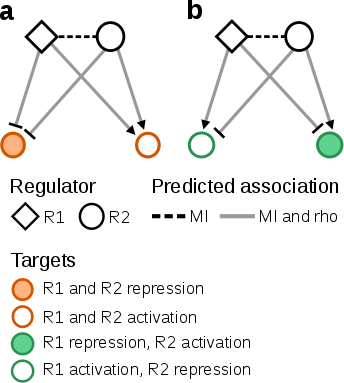
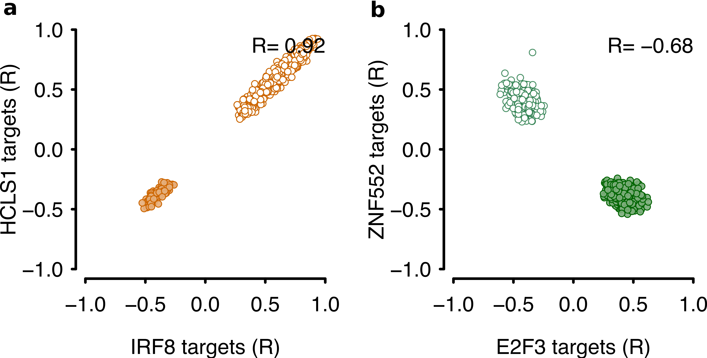

# Overview
Recurrent patterns in biological networks have been termed network motifs [@Bracken2016], which may reflect critical roles in multiple biological processes; for example, regulatory loops between transcription factors and microRNAs [@Zhang2015]. **RTNduals** searches for targets shared between pairs of regulators, using regulatory networks generated by the **RTN package** (for details, please refer to the [RTN documentation](http://bioconductor.org/packages/RTN/)) [@Castro2016]. In such a network, each regulator has an associated set of gene targets (i.e. a regulon), and when we assess the shared targets in the regulons of a pair of regulators, we find that each shared target may be regulated in a positive or negative direction by a given regulator (i.e. pairs of regulators can either agree or disagree on the predicted downstream effects for a shared target gene). 'Dual regulons' represent regulon pairs whose common targets are likely to be affected by both regulators. The inference of 'dual regulons' requires three complementary statistics: (1) Targets are assigned to regulons based on MI between the regulator and the target. The significance of the MI statistics is assessed by permutation and bootstrap analysis. The association between pairs of regulators is also identified in this step, since regulators can target each other. (2) Shared targets between any two regulons are identified and the similarity in regulation (i.e. positive or negative direction) is assessed by correlation analysis. Single network motifs are identified in this step consisting of two regulators and one common target. (3) A test is carried out to determine if the correlation between the set of network motifs of any two regulons is higher than would be expected by chance. The schematics in **Figure 1** show examples of 'dual regulons' with two network motifs each. In (a) the two regulators agree on the downstream effects (i.e. same directions), while in (b) they disagree (i.e. opposite directions). Our method can be applied to any regulatory relationship. For gene expression data sets typical regulators might include transcription factors, miRNAs, eRNAs and lncRNAs.



<legend><b>Figure 1</b> -  Examples of regulators and predicted associations. This figure illustrates two ‘dual regulons’ and the respective downstream effects. (<b>a</b>)  Regulators R1 and R2 agree in both activation (open circle) and repression (filled circle). (<b>b</b>) Regulators R1 and R2 disagree. </legend>


# Quick Start
The **RTNduals** workflow starts with a preprocessing step that generates an **MBR-class** (Motifs Between Regulons) object from an expression matrix and two lists of regulators. The expression matrix is typically obtained from multiple samples (e.g. transcriptomes from a cancer cohort), while the lists of regulators represent some prior biological information indicating which genes in the expression matrix should be regarded as regulators. The input data can also deal with two classes of regulators; for example, genes and microRNAs. In this case, the expression matrix should comprise mRNA and miRNA expression values. Alternatively, the **MBR-class** object can be obtained by combining two **TNI-class** objects pre-computed in the **RTN** package.

## Load datasets
This example provides the data required to generate an **MBR-class** object. The dataset **dt4rtn** is available from the **RTN** package and consists of an R list with 6 objects, 3 of which will be used in the subsequent analysis: (1) **gexp**, a named gene expression matrix with 250 samples (genes in rows, samples in cols), (2) **gexpIDs**, a data.frame with Probe-to-ENTREZ annotation, and (3) **tfs**, a named vector listing transcription factors (in this case, 149 TFs). While these datasets were extracted, pre-processed and size-reduced from @Fletcher2013 and @Curtis2012, they should be regarded as examples for demonstration purposes only

```{r include=FALSE}
library(RTNduals)
data("dt4rtn", package = "RTN")
gexp <- dt4rtn$gexp
annot <- dt4rtn$gexpIDs
tfs1 <- dt4rtn$tfs[c("IRF8","IRF1","PRDM1","AFF3","E2F3")]
tfs2 <- dt4rtn$tfs[c("HCLS1","STAT4","STAT1","LMO4","ZNF552")]
```

```{r eval=FALSE}
##---load package and prepare a dataset for demonstration
library(RTNduals)
data("dt4rtn", package = "RTN")
gexp <- dt4rtn$gexp
annot <- dt4rtn$gexpIDs
tfs1 <- dt4rtn$tfs[c("IRF8","IRF1","PRDM1","AFF3","E2F3")]
tfs2 <- dt4rtn$tfs[c("HCLS1","STAT4","STAT1","LMO4","ZNF552")]
```

## Preprocessing
The **gexp** data matrix and the corresponding annotation are evaluated by the `mbrPreprocess` function in order to check the consistency of the input data. After this step it is generated a pre-processed **MBR-class** object whose status is updated to 'Preprocess [x]'.

```{r eval=TRUE}
##---generate a pre-processed BR-class object
rmbr <- mbrPreprocess(gexp=gexp, regulatoryElements1=tfs1, regulatoryElements2=tfs2, gexpIDs=annot, verbose = FALSE)
rmbr
```

## Run the permutation analysis
The `mbrPermutation` method inherits the same algorithm implemented in the **RTN** package. This function takes the pre-processed **MBR-class** object and returns two regulatory networks that are inferred by mutual information analysis (with multiple hypothesis testing corrections). The results are included in the 'TNI' slots, which will be used in the subsequent steps of the pipeline.

```{r eval=TRUE}
##---compute two regulatory networks
##---(set nPermutations>=1000)
rmbr <- mbrPermutation(rmbr, nPermutations=100, verbose = FALSE)
rmbr
```

## Run the bootstrap analysis
In additional to the permutation analysis, the stability of the regulatory networks is assessed by bootstrapping using the `mbrBootstrap` function, which also inherits the same algorithm from the **RTN** package. Each 'TNI' slot of the **MBR-class** object is updated with a consensus bootstrap network.

```{r eval=TRUE}
##---check the stability of the two regulatory networks
##---(set nBootstrap>=100)
rmbr <- mbrBootstrap(rmbr, nBootstrap=10, verbose=FALSE)
rmbr
```

## Run DPI filter
In a given regulatory network each target can be linked to multiple regulators as a result of both direct and indirect interactions. The Data Processing Inequality (DPI) algorithm [@Meyer2008] is used to remove the weakest interaction between two regulators and a common target. This step inherits the algorithm that is implemented in the **RTN** package, and it is optional for the analyses described in this workflow (the results of this step can be used to assess regulon activity in the **RTN** package).

```{r eval=TRUE}
##---apply DPI algorithm
rmbr <- mbrDpiFilter(rmbr, eps=0.05, verbose=FALSE)
rmbr
```

## Run the association analysis between regulons
The `mbrAssociation` method takes the two transcriptional networks computed in the previous steps and enumerates all motifs between all regulons. The method retrieves the mutual information between regulators and assesses the agreement between the predicted downstream effects using correlation analysis. A hypergeometric test is used to evaluate whether the common targets are potentially affected by both regulators in a number greater than what would be expected by chance. A summary of the results can be accessed from the 'summary' slot using the `mbrGet` function.
```{r eval=TRUE}
##---run the main RTNduals methods
rmbr <- mbrAssociation(rmbr, prob=0.75, verbose=FALSE)
rmbr
```

```{r eval=TRUE}
mbrGet(rmbr, what="summary")
```

## Rank 'dual regulons'
The `mbrDuals` method ranks all candidates using the correlation values computed in the `mbrAssociation` step, and returns the list of 'dual regulons'. Also, when a supplementary.table is available this method can add complementary evidence regarding the association between regulators. The supplementary.table is a 'data.frame' listing unique relationships between any two regulators used to compute the 'dual regulons' (please refer to the documentation for details on the input data format).

```{r eval=TRUE}
##---make a toy example of additional evidences
motifsInformation <- mbrGet(rmbr, what="motifsInformation")
n <- nrow(motifsInformation)
supplementaryTable <- motifsInformation[1:n,c("Regulon1","Regulon2")]
supplementaryTable$ToyEvidence <- rnorm(n)

##---run mbrDuals
rmbr <- mbrDuals(rmbr, supplementary.table = supplementaryTable, 
                  evidenceColname = "ToyEvidence", verbose = FALSE)
```

## Visualize the shared cloud of targets
The package provides the `mbrPlotDuals` function to visualize 'dual regulon' and the respective motifs, which represent the shared cloud of targets. **Figure 2** shows two examples of 'dual regulons' for the schematics illustrated in **Figure 1**. In **(a)** the two regulators agree on the downstream effect (i.e. same directions), while in **(b)** they disagree (i.e. opposite directions).

```{r eval=FALSE}
dual <- mbrGet(rmbr, what="dualRegulons")[1]
mbrPlotDuals(rmbr, names.motifs = c(dual), alpha = 0.90)
```


<legend><b>Figure 2.</b>  The <b>'mbrPlotDuals'</b> function shows the shared cloud of targets. In (<b>a</b>) the regulators agree on the downstream effects, while in (<b>b</b>) they disagree. The colour pattern follows the schematics in <b>Figure 1</b>.</legend>

## Session Info
```{r}
sessionInfo()
```

## References
